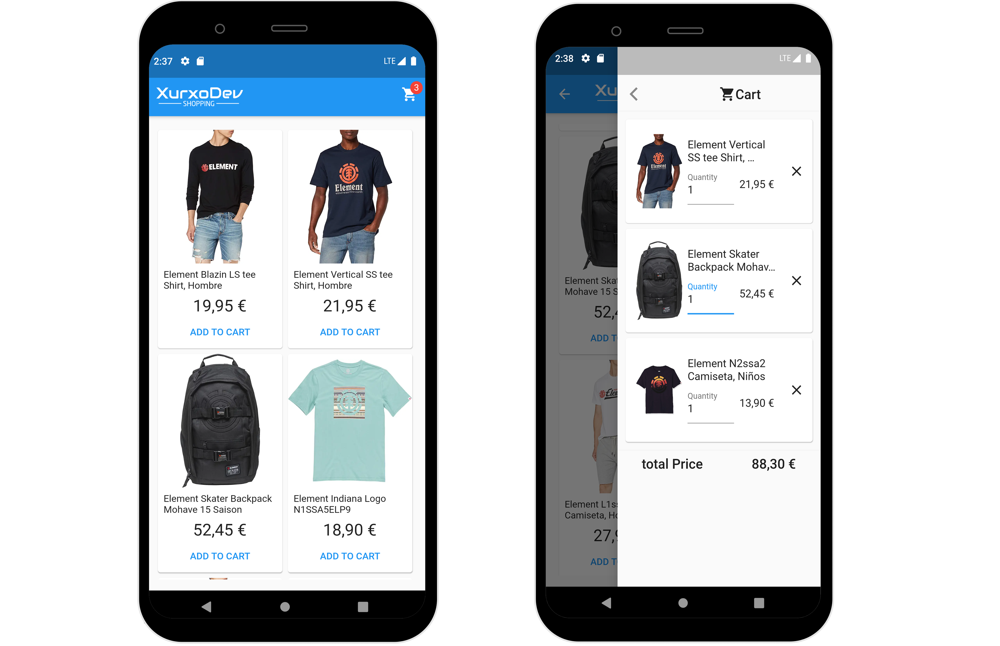

# UC-Flutter-SuperStudent-2

قم ببناء متجر الكتروني خاص بك

يعد إنشاء متجر للتجارة الإلكترونية طريقة رائعة  لممارسة مهاراتك في البرمجة. تعتبر العناصر المطلوبة لمتجر عبر الإنترنت أكثر تعقيدًا قليلاً ، لأن هذا المشروع يحتاج إلى أكثر من مجرد قاعدة بيانات مستخدم . هنا سوف تحتاج إلى تصميم برنامج يقوم بعرض صفحة منتجات و عربة تسوق و صفحة الدفع وعناصر أخرى متعلقة بالمتجر الإلكترونية.

